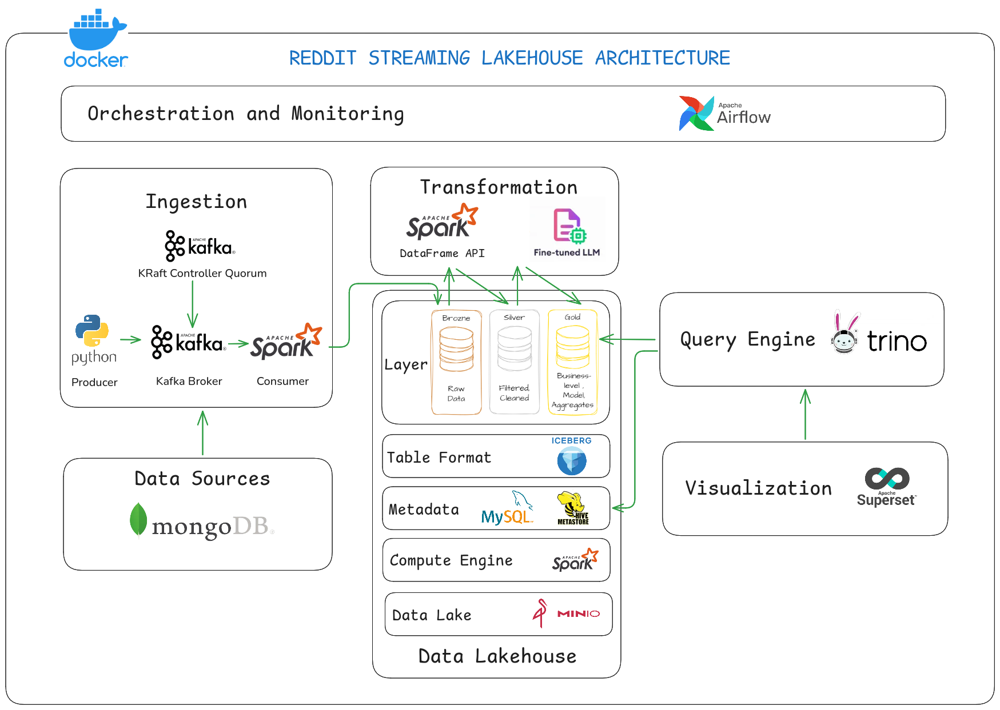
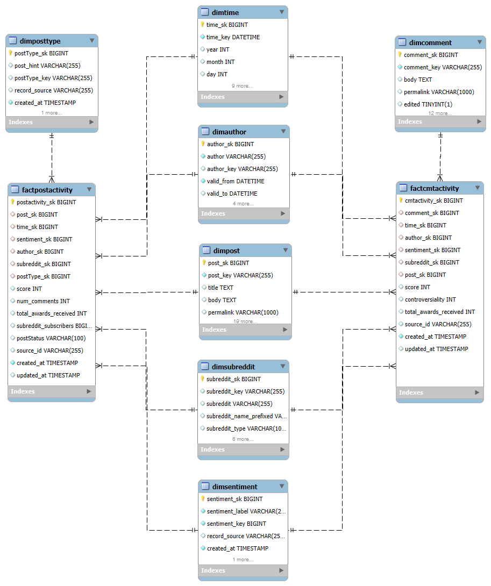
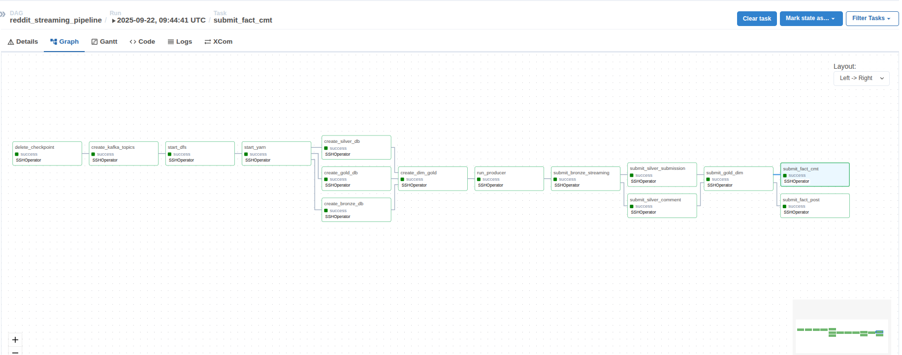

# Reddit Streaming Lakehouse

## I. Overview

The **Reddit Streaming Lakehouse** project collects and analyzes Reddit data with a **streaming pipeline**.  
The system ingests Reddit posts and comments, processes them through multiple data layers (Bronze -> Silver -> Gold), and stores them in a Lakehouse.  
From there, the data is used for trend analysis, sentiment detection, and dashboard visualization.

**Context:**  
Reddit is one of the largest online discussion platforms. People share opinions on events, products, and social issues.  
By processing Reddit data in a streaming way, we can detect trending topics, measure community sentiment, and provide insights for research or business.

---
## II. Objectives

### 1. Business Goals

- Monitor social trends from popular subreddits.
- Analyze community sentiment (Positive, Negative, Neutral).
- Summarize and classify content from topic-specific subreddits.
### 2. Technical Goals

- Extract Reddit data stored in **MongoDB**.
- Send MongoDB data to **Kafka topics** using a custom Python Producer.
- Process streaming data with **Spark Structured Streaming**.
- Apply a **fine-tuned LLM** for sentiment and topic analysis.
- Store data in **Apache Iceberg on MinIO**, with **Hive Metastore (MySQL)** for metadata.
- Query data with **Trino**.
- Build dashboards with **Apache Superset**.
- Orchestrate the pipeline end-to-end with **Apache Airflow**.

---
## III. Architecture

**Streaming Lakehouse Pipeline:**
1. **Ingestion:** MongoDB -> Kafka
2. **Processing:** Spark Structured Streaming (Bronze -> Silver -> Gold)
3. **Storage:** Apache Iceberg on MinIO with Hive Metastore (MySQL)
4. **Query:** Trino
5. **Visualization:** Superset
6. **Orchestration:** Apache Airflow




---
## IV. Data

- **Source:** Reddit API (posts & comments) from June 2026.
- **Data Layers (Medallion Architecture):**
    - **Bronze:** raw data from Kafka.
    - **Silver:** cleaned and enriched data with sentiment/topic labels.
    - **Gold:** fact and dimension tables for BI and dashboards.

**Data Warehouse Schema**



---
## V. Setup
### 1. Build and Start Environment

All services (Spark, YARN, Kafka, MinIO, Hive Metastore, Trino, Superset, Airflow) are combined in one script.  
Run the following command in root folder:
```bash
source ./scripts/startServices.sh
```
This will:
- Start Docker containers (Spark cluster, Kafka, MinIO, Hive Metastore, Trino, Superset, Airflow).
- Configure networks.
- Prepare volumes and paths.
### 2. Prepare MongoDB

1. Download the Reddit dataset (`jsonl` files).  
  [Data cleaned Reddit](https://drive.google.com/drive/folders/1RmmcRUXcTS2jWs2w4lJ0TqdUUX10KfX9?usp=sharing)
    At the root of the project, create a folder called `data` and put both 2 `jsonl` files inside.
2. Create a free MongoDB Cloud account.  
    Create a **database** and **collection**.
3. Go to the folder `src/dataMongoDB` and update the connection string in `.venv` to point to your MongoDB.  
- Then run the upload script:
```bash
    cd ./src/dataMongoDB/
    pip install -r requirement.txt
    python upload.py
```

---
## VI. Usage

### 1. Access Airflow UI

Airflow is already included in the setup.  
Open your browser: [http://localhost:8089/](http://localhost:8089/)

- Default user: `admin`
- Default password: admin
### 2. Run the Pipeline

In Airflow UI:
1. Go to **DAGs**.
2. Find the DAG named **`reddit_streaming_pipeline`**.
3. Click play button



This will automatically:
- Start DFS and YARN.
- Create Kafka topics (`redditSubmission`, `redditComment`).
- Clear old checkpoints in MongoDB.
- Create databases in Iceberg (Bronze, Silver, Gold).
- Run Producer (MongoDB → Kafka).
- Submit Spark jobs (Bronze → Silver → Gold).
- Load results for dashboards in Superset.

---

### 3. Dashboard

After the DAG finishes, open **Superset** at: [http://localhost:8088/](http://localhost:8088/)
- Default user: `admin`
- Default password: `AdminPassword123!`

There you can see dashboards with:
- Post and Comment statistics.
- Subreddit activity by hour.
- Community sentiment trends.
- Top domains shared.
- Subreddit insights (heatmap, treemap, bubble chart…).

Or you can see our dashboard here: [reddit-streaming-lakehouse](https://reddit-streaming-lakehouse.vercel.app/)

---
## VII. Run Step by Step to Understand

### 1. Create Kafka Topics

Go inside the Kafka container and run:

```bash
kafka-topics.sh --create --topic redditSubmission --bootstrap-server kafka1:9092 --replication-factor 2
kafka-topics.sh --create --topic redditComment --bootstrap-server kafka1:9092 --replication-factor 2
```

---

### 2. Producer – Collect Reddit Data
Go to Confluent Kafka environment and run:
Delete old checkpoints:

```bash
source /opt/venv/bin/activate 
python scripts/delAllDocument.py
```

```bash
source /opt/venv/bin/activate 
python scripts/producer.py
```

---

### 3. Consumer – Bronze Layer

Open Spark shell and create the database:

```bash
spark.sql("create database spark_catalog.bronze")
spark.sql("create database spark_catalog.silver")
spark.sql("create database spark_catalog.gold")
```

Run Spark job:

```bash
spark-submit --py-files utils.zip mainBronze.py
```

---

### 4. Transform – Silver Layer

```bash
spark-submit --py-files transformer.zip,utils.zip mainRsSilver.py
spark-submit --py-files transformer.zip,utils.zip mainRcSilver.py
```

---

### 5. Transform – Gold Layer

```bash
spark-submit --py-files utils.zip createDim.py
spark-submit --py-files transformer.zip,utils.zip mainDimGold.py
spark-submit --py-files transformer.zip,utils.zip mainFactPost.py
spark-submit --py-files transformer.zip,utils.zip mainFactCmt.py
```

---

### 6. Check Data
Use spark-shell:
```bash
spark-shell \

--conf spark.sql.catalog.spark_catalog=org.apache.iceberg.spark.SparkSessionCatalog \
--conf spark.sql.catalog.spark_catalog.type=hive \
--conf spark.sql.extensions=org.apache.iceberg.spark.extensions.IcebergSparkSessionExtensions
```

Use Superset:
Example:
```sql
SELECT * FROM bronze.reddit_submission;
SELECT * FROM silver.reddit_comment;
SELECT * FROM gold.dimtime;
```

---


## VIII. Contact

**Authors:**
- [**Quoc Huy Nguyen**](https://www.linkedin.com/in/huy-dataguy), 
- [**Minh Nhat Nguyen Ngoc**](https://www.linkedin.com/in/huy-dataguy)

**Email:**
- [quochuy.working@gmail.com](mailto:quochuy.working@gmail.com)
-  [quochuy.working@gmail.com](mailto:quochuy.working@gmail.com)